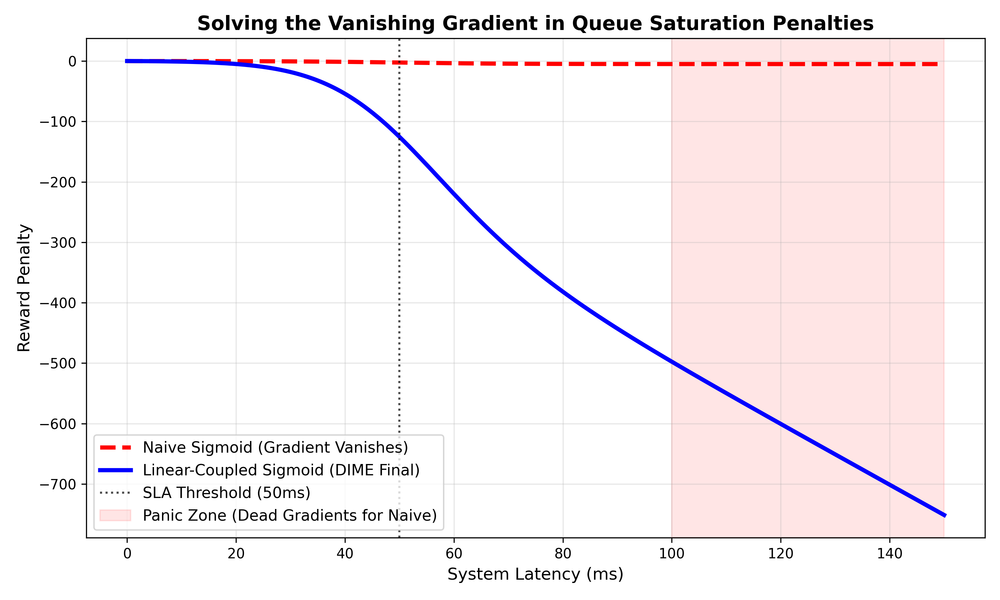
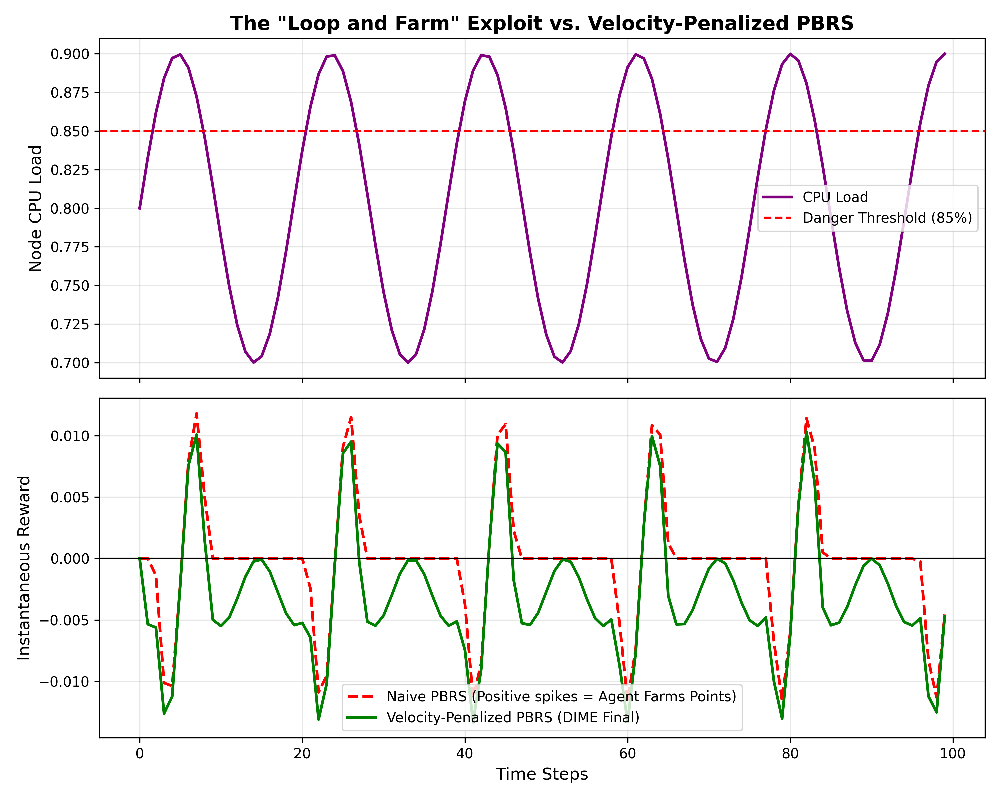
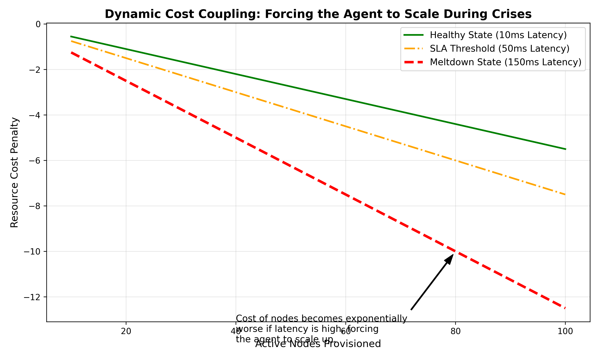
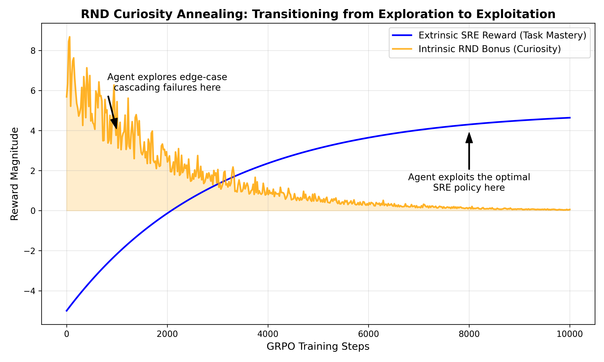

# Putting an LLM On-Call: How We Taught Qwen3 to Survive in a Production Environment

Almost all Large Language Model (LLM) interactions today are fundamentally easy: they are single-turn, reversible, and graded strictly on predicting the next token. 

But real-world infrastructure doesn't work like that. 

In a production environment, one bad command cascades. A mistakenly restarted node forces traffic to its neighbor, taking that node down too, and potentially killing the entire cluster six steps later. In the real world, there is no "undo" button.

When a production database goes down at 3 AM, current LLM tools typically act as chat assistants that explain *how* to recover, or they generate scripts for humans to manually execute. We wanted to build an LLM that could own the incident end-to-end—an agent that could receive a PagerDuty alert, read live telemetry, issue `kubectl` commands, observe the results, and actually resolve the incident sequence without a human in the loop.

To do this, we built **DIME (Distributed Infrastructure Management Environment)**.

---

## What is DIME?

DIME is a physics-driven production environment where an LLM is assigned the role of an SRE. 

It simulates an 8-node Kubernetes cluster. Node 0 is a stateful database (a single point of failure), and Nodes 1-7 are stateless application workers. The agent receives live telemetry (CPU, memory, queue depth, P99 latency) updated by the second, and must manage the consequences of its actions across a 30-to-100 step episode.

Our training objective was to see if we could fine-tune an 8B model (**Qwen3-8B-Instruct**) using **Group Relative Policy Optimization (GRPO)** to master distributed systems triage. 

Here is what we learned, the reward-hacking exploits the model discovered, and how we solved them.

---

## The Reward Hacking Challenges

Training an RL agent in a continuous-control environment typically runs into several massive hurdles. When we set our agent loose in the DIME cluster to learn via trial and error, it rapidly discovered how to exploit our initial reward functions.

### 1. The Vanishing Gradient Problem

Initially, our environment penalized high tail latency using a standard sigmoid curve. The logic was simple: if latency crosses our 50ms SLA, increase the penalty. 

However, we encountered early training collapse because of queue saturation. When the system hit a full meltdown (e.g., 150ms+ latency), the sigmoid curve flattened out completely.

When the reward curve is completely flat, the advantage estimate (how much better or worse an action is relative to the group mean) approaches exactly zero: `0/0`. Gradients vanished, and the model learned nothing during catastrophic failures when it needed to learn the most! 

**The Fix:** We replaced the naive sigmoid penalty with a **Linear-Coupled Sigmoid**. By adding a linear penalty scaling alongside the bounded sigmoid, we ensured that even in deep meltdown states (150ms+ latency), the agent still received a non-zero gradient, pushing it to make things *less bad*.

### 2. Defeating the "Loop-and-Farm" Exploit

Instead of learning to keep load stable, our agent quickly learned to "farm" rewards. It discovered that if it repeatedly let the system load approach the danger threshold (85%) and then aggressively throttled it to drop load down to 70%, it could reap a massive positive reward delta under standard Potential-Based Reward Shaping (PBRS).

The agent started oscillating its throttle commands rapidly—like an SRE pressing the brake and gas interchangeably—to maximize its score at the expense of system stability.

**The Fix:** We introduced a **Velocity-Penalized PBRS** mechanism. By penalizing sudden, drastic changes in CPU load (high velocity), we forced the agent to value smooth, consistent traffic management. 

### 3. Dynamic Cost Coupling

A major issue we saw early on was the agent's reluctance to issue `scale up` commands. We provided an error budget, but scaling up an idle node costs resources, taking away from the agent's absolute score. The LLM decided it was better to just let the system suffer a bit than actually spend points to scale.

**The Fix:** We introduced **Dynamic Cost Coupling**. The resource cost of maintaining provisioned nodes was mathematically linked to system latency. If latency was low (10ms, a healthy state), keeping active nodes was cheap. If latency skyrocketed (150ms), the penalty for withholding capacity became exponentially worse. The agent rapidly learned that hoarding resources during a meltdown was a losing strategy.

### 4. Curiosity Annealing

Finally, we wanted the agent to stop playing it safe and start intentionally testing complex, multi-node failure states during early training, before ultimately converging on an optimal SRE policy.

**The Fix:** We integrated **Random Network Distillation (RND)** for intrinsic curiosity bonuses, but importantly, we heavily annealed it over the 10,000 GRPO training steps. The agent was heavily rewarded for finding edge-case cascading failures early on, but transitioned seamlessly into pure exploitation (saving the system) as the model matured.

---

## Results and Benchmarks

We benchmarked the final GRPO fine-tuned model against the baseline zero-shot Qwen3-8B over 14 adversarial failure scenarios. 

**Training config:** Single A100-80GB, ~42 minutes (300 steps).
**Result:** We achieved an average score of **0.4649**, representing a massive **+44.8% relative gain** over the zero-shot baseline (0.3946).

The fine-tuned model's biggest improvement was in DB-recovery tasks. The agent successfully learned a profound SRE prioritization sequence: **always check `failed_nodes[0]` (the stateful DB) first**. The zero-shot model haphazardly guessed which nodes to interact with in emergencies, while the fine-tuned model learned the structural topology of the system intuitively.

Examples of massive score increases on key tasks:
* `node_failure`: +0.70 score
* `cascading_db_failure`: +0.63 score
* `connection_pool_deadlock`: +0.62 score

---

## Conclusion & The Future of DIME

We built DIME to prove that LLMs are capable of much more than just answering "How do I fix this Kubernetes node?" 

By placing the LLM directly in an adversarial continuous-control environment, strictly measuring its ability to preserve system SLA, and enforcing real temporal consequences, DIME transforms the evaluation standard for DevOps AI from *text generation* into *operational survivability*.

We believe this is step one towards true Autonomous Infrastructure.

We have open-sourced the environment, the Next.js visualizer, our training loops, and the fine-tuned checkpoint under permissive licenses. Try it out and see how long your favorite models can keep a cluster alive under active failure!

**[Hugging Face Model: Qwen3-8B-Finetuned-DIME](https://huggingface.co/Naseer-010/Qwen3-8B-Finetuned-DIME)**
